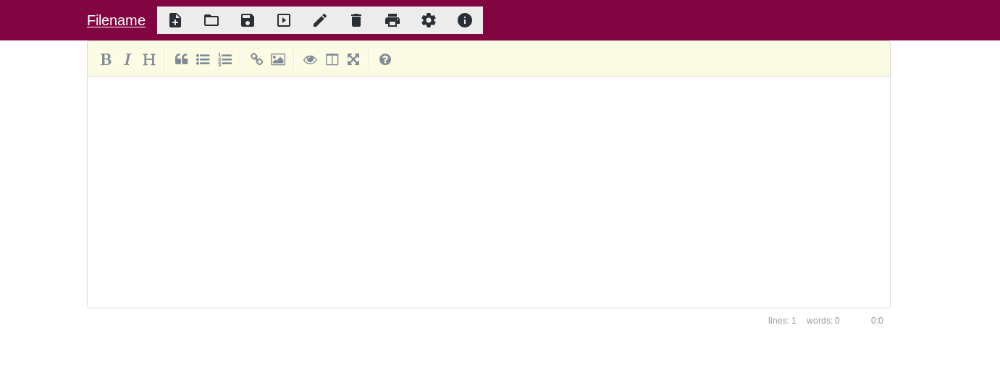

# litepad
A lite web based notepad for webspaces and server

---

---

## Requirements
This application requires only php installed on your webspace or server. 
Bootstrap and the jQuery Framework are included by default.

## Features
This application is under active development and needs some time for the first release version

### Impmented
* Mobile device support by default
* Create/open notes
* Markdown support and viewer

### Upcoming features
* Printing the markdown layout
* Security features 
* simple php configuration file
* markdown helper (Buttons for bold text etc.) 
* notifications if files have saved/load/print successful

### In later versions
* encrypt your textfiles by default (asks for decryption-key if you will open it)
* split screen editor for non mobile devices (texteditor and markdown view side by side)
* change UI colors/colorschemes

## Where will my notes be saved?
The notes will be saved as simple textfiles under litepad/notes
